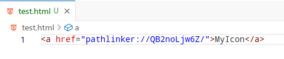

<div align="center">
  
  <h1>PathLinker</h1>
  <p>🔗 Link any of your files anywhere on your computer! 🔗</p>
</div>

[](./README.md)
[](./README_CN.md)

## ✨ Features
- Supports Windows, Linux
- Can convert your file paths to URLs via the program and use them where URLs are accepted, such as in markdown, HTML, and other programs that allow URL insertion
- Files corresponding to URLs can be opened via the URL

## 📦 Installation
### Windows
1. Download and unzip [pathlinker_0.3.0_x64_windows.zip](https://github.com/JeseKi/PathLinker/releases/download/v0.3.0/pathlinker_0.3.0_x64_windows.zip)
2. Double-click `pathlinker_0.3.0_x64_en-US.msi` to install (*recommended not to change the installation path*)
3. Run `register.bat` to add registry entries

### Linux
#### deb
1. Download the [deb package](https://github.com/JeseKi/PathLinker/releases/download/v0.3.0/pathlinker_0.3.0_amd64.deb)

2. Execute `sudo dpkg -i pathlinker_0.3.0_amd64.deb`
#### AppImage
1. Download and unzip [pathlinker_0.3.0_amd64_AppImage.zip](https://github.com/JeseKi/PathLinker/releases/download/v0.3.0/pathlinker_0.3.0_amd64_AppImage.zip)
2. Execute
```bash
# Add the application to the registry
sudo bash init.sh
# Grant execution permission
sudo chmod +x pathlinker_0.3.0_amd64.AppImage
```

### Mac
Since I don't have a Mac yet, I hope developers with a Mac can help me complete this part. If interested, please contact me via email.

## 🛠️ Usage
### Via UI
1. Open `pathlinker`
2. Click `select files`

3. Select the files you want to map (you can select multiple at once)

4. You can click `copy` to copy the corresponding URL for the mapping

5. Now you can use this URL to open the file elsewhere, such as in Obsidian (a markdown note-taking software):


Or XMind (a mind mapping software):


Of course, HTML is also included:



6. Now when you click the URL, the file will be opened with the default software:


### Via Shortcut Key
1. When the application starts, you can quickly open a file selector with `ctrl+shift+c`, like this:

2. After selecting the file, an automatically generated hyperlink in the standard format of `[file_name.extension](url)` will be copied to the clipboard, and you can directly use `ctrl+v` to use it in the editor.


## 📝 ToDo
- [ ] Support for Mac
- [x] Quick creation of mappings and pasting into the editor via shortcut keys
- [x] Multilingual support
- [ ] Automatic version updates
- [ ] Support for batch file management on the frontend
- [ ] Support for searching linked files by file name on the frontend
- [x] Independent of the original path
- [ ] Settings page
  - [ ] Automatically delete the mapping path when the source file is deleted
  - [ ] Use a specific software to open files with a specified extension
  - [ ] Customize the hard link creation mode
- [ ] Implement error reporting when opening files, instead of displaying `log.txt`
- [ ] Allow export/import of file mapping data

## 😕 FAQ

### Why doesn't any file open when I click the URL?
Please make sure you have followed the steps, pay attention to running `register.bat` on Windows, and if you are using AppImage on Linux, you need to run `init.sh`. If it still doesn't work, please try submitting issues.

### Is it safe?
The principle of PathLinker is to create a fixed hard link for the file, then store the hard link path in the database, and generate a random URL to store in the database together. When the URL is clicked, the system registry will pass the URL to the application, and the application, upon receiving the URL, will automatically query the corresponding hard link path in the database and use the obtained path to call the default program to open the file.
Therefore, you don't have to worry about the following issues:
1. Will the URL being leaked online lead to file access?
2. Will the database being leaked online lead to file access?
3. Will the software accidentally modify important system files?

### Can I still use it normally after changing to a different computer?
Yes, after changing to a different computer, as long as you ensure that the database file and the file system are both moved together, you can ensure normal use.

You can understand that as long as you ensure the hard disk's drive letter remains unchanged, even if you change computers, you can still use it normally.
For the Windows system, for example, if the file you are mapping is on the C drive, such as: `C:\Users\YourName\Desktop\mydoc.docx`, when you change computers, just make sure this file is also on the C drive and on the original hard disk, you can ensure normal use.
For the Linux system, since I usually use it under the home directory, you can also use it normally by directly transferring the hard disk to another computer.

We will add the functionality to export the database file and import the database file in subsequent updates to facilitate database transfer and transfer between different hard disks and file systems.

### Will the mappings I create take up a lot of additional hard disk storage space?
No.

The principle of a hard link is to point to a storage address, so the hard disk storage space occupied by a new hard link can be basically negligible.

However, since it is a hard link that is created, when you delete the source file, the hard disk storage space occupied by the source file will not be released. It will only be released after you delete the corresponding mapping in PathLinker. We will add a setting option in subsequent updates to automatically delete the mapping file when the source file is deleted.