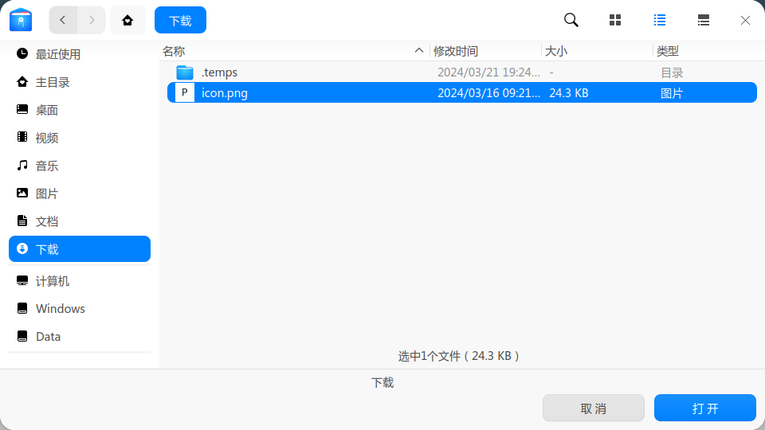
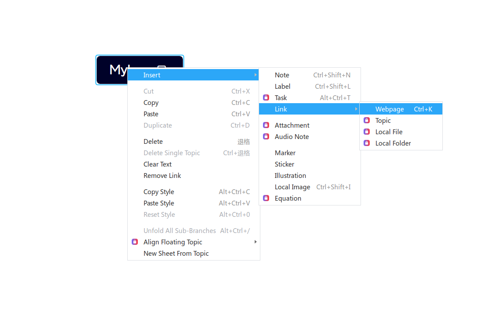
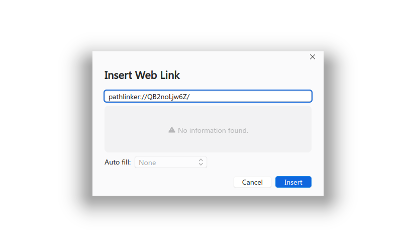

<div align="center">
  
  <h1>PathLinker</h1>
  <p>🔗 Link any file anywhere on your computer! 🔗</p>
</div>

[](./README.md)
[](./README_CN.md)

## ✨ Features
- Supports Windows, Linux
- Allows you to convert the path of your files into URLs through the program, which can be used in places where URLs are supported, such as markdown, HTML, and other programs that allow URL insertion
- Files corresponding to URLs can be opened via the URL

## 📦 Installation
### Windows
1. Download and unzip [pathlinker_0.1.0.1_x64_windows.zip](https://github.com/JeseKi/PathLinker/releases/download/preview/pathlinker_0.1.0.1_x64_windows.zip)
2. Double-click `pathlinker_0.1.0.1_x64_windows.msi` to install (**recommended not to change the installation path**)
3. Run `register.bat` to add registry entries.

### Linux
#### deb
1. Download the [deb package](https://github.com/JeseKi/PathLinker/releases/download/preview/pathlinker_linux_0.1.0-1_amd64_AppImage.zip)

2. Execute `sudo dpgk -i pathlinker_linux_0.1.0-1_amd64.deb`
#### AppImage
1. Download and unzip [pathlinker_linux_0.1.0-1_amd64_AppImage.zip](https://github.com/JeseKi/PathLinker/releases/download/preview/pathlinker_linux_0.1.0-1_amd64_AppImage.zip)
2. Execute
```bash
# Add the application to the registry
sudo bash init.sh
# Grant execution permission
sudo chmod +x pathlinker_0.1.0-1_amd64.AppImage
```

### Mac
Since I don't have a Mac yet, I hope developers with Mac can help me complete this part. If interested, please contact my email.

## 🛠️ Usage
1. Open `pathlinker`
2. Click `select files`


3. Select the file(s) you want to map (you can select multiple at once)


4. You can click `copy` to copy the URL corresponding to the mapping


5. Now you can use the URL to open the file in other places, such as Obsidian (a Markdown note-taking software):


Or XMind (a mind mapping software):




And even HTML:


6. When you click on the URL, the file will be opened with the default software:
 


## 📝 ToDo
- [ ] Support for Mac
- [ ] Multilingual support
- [ ] Automatic update version
- [ ] Support searching linked files by filename in the frontend.
- [ ] Support batch file management in the frontend
- [ ] Not dependent on the original path
- [ ] Set up page
  - [ ] When the source file is deleted, the mapped path is automatically deleted
  - [ ] Set the directory used for automatic tracking to be pathlinker directory
  - [ ] Use specific software to open files with specified extensionsied extensions.
  - [ ] Custom hard link creation mode
- [ ] Implementation of error reporting when opening files, instead of showing `log.txt`
- [ ] Allow for exporting/importing file mapping data

## 😕 FAQ

### Why didn't any file open when I clicked on the URL?
Please check if you have followed the steps. On Windows, make sure to run `register.bat`, and on Linux, if you are using AppImage, you need to run `init.sh`. If it still doesn't work, please try submitting issues.

### Is it safe?
PathLinker operates by creating a fixed hard link for files, storing the hard link path in a database, and generating a random URL to be stored alongside in the database. When the URL is clicked, the system registry passes the URL to the application, which then queries the corresponding hard link path from the database and uses it to open the file with the default program. Therefore, you don't need to worry about the following issues:
1. Will the file be accessed if the URL is leaked online?
2. Will the file be accessed if the database is leaked online?
3. Will the software accidentally modify important system files?

### Can it still be used normally after switching to a different computer?
Yes, after switching to a different computer, as long as the database file and the file system are moved together, normal usage is ensured.

You can understand it as long as the disk drive letter remains unchanged, even if you switch computers, it can still be used normally. For Windows systems, if the mapped file is on the C drive, like this: `C:\Users\YouName\Desktop\mydoc.docx`, when you switch computers, just ensure that the file is also on the C drive and on the original disk to ensure normal usage. For Linux systems, since I mostly use the home directory, transferring the hard drive to another computer will also work fine.

We will add the functionality to export and import database files in future updates to facilitate database transfer and transitions between different disks and file systems.

### Will the mappings I create occupy a lot of disk storage space?
No.

The principle of hard links is to point to a storage address, so the disk storage space occupied by a new hard link is negligible.

However, since it's a hard link, when you delete the source file, the disk space occupied by the source file itself will not be released. The space will only be freed after deleting the corresponding mapping in PathLinker. We will add an option to automatically delete the mapped file when the source file is deleted in future updates.
