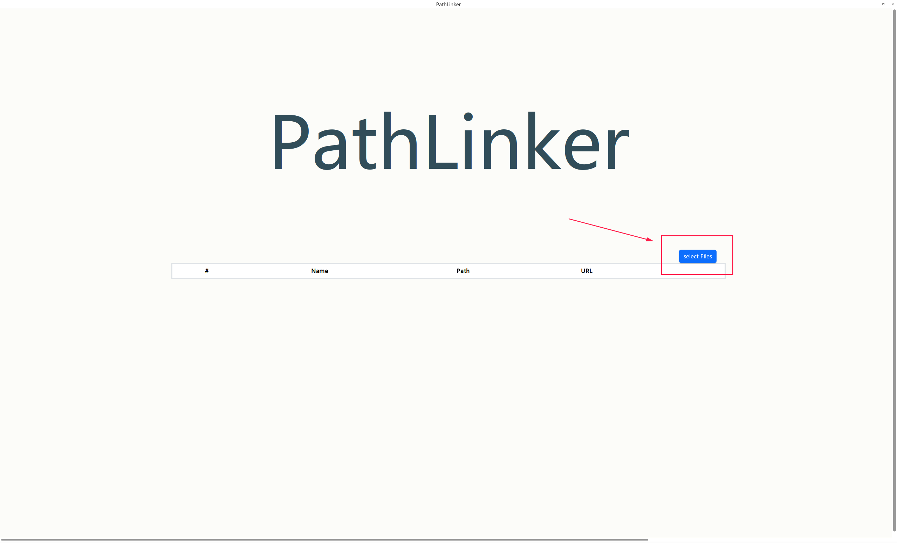
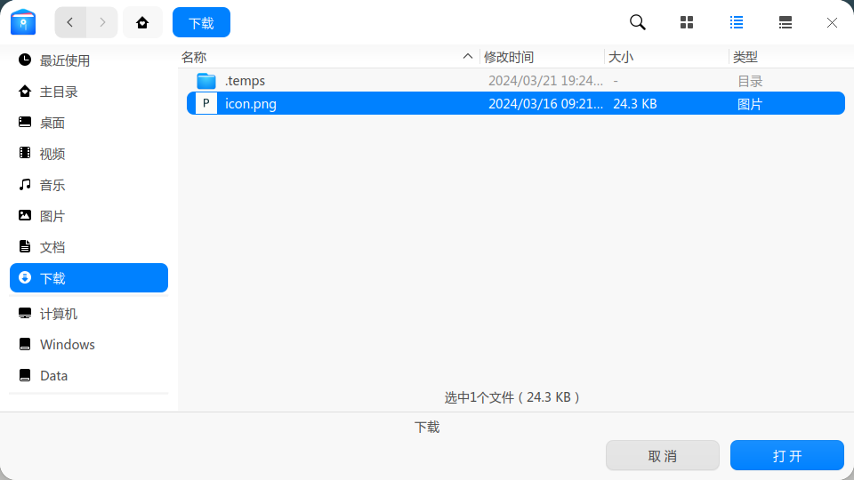
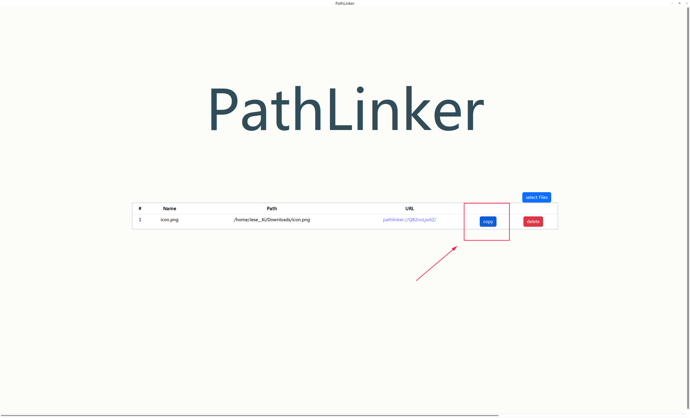
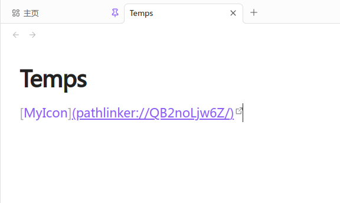
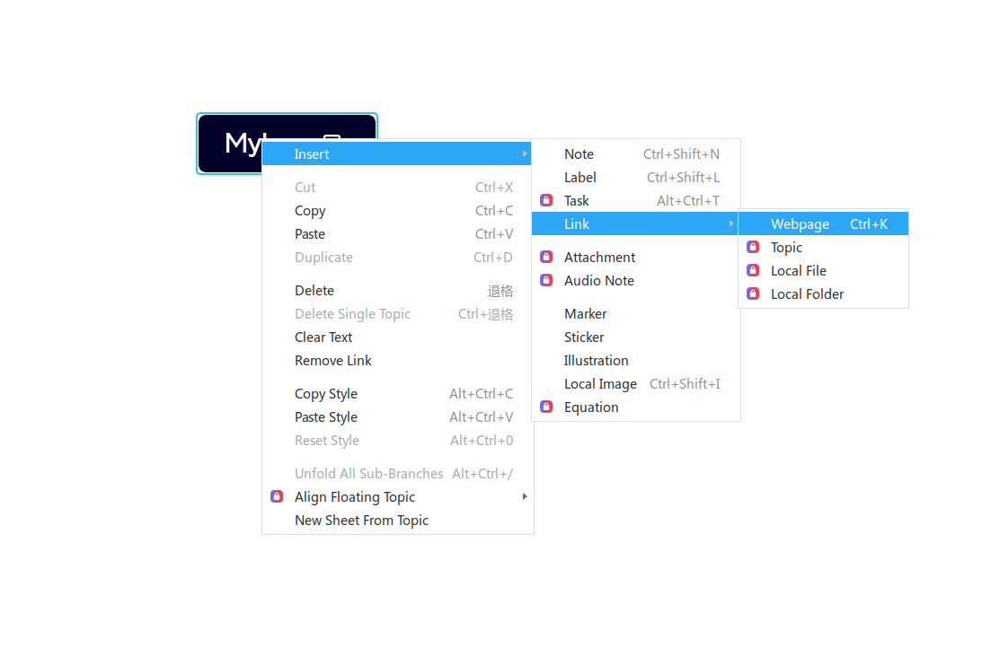
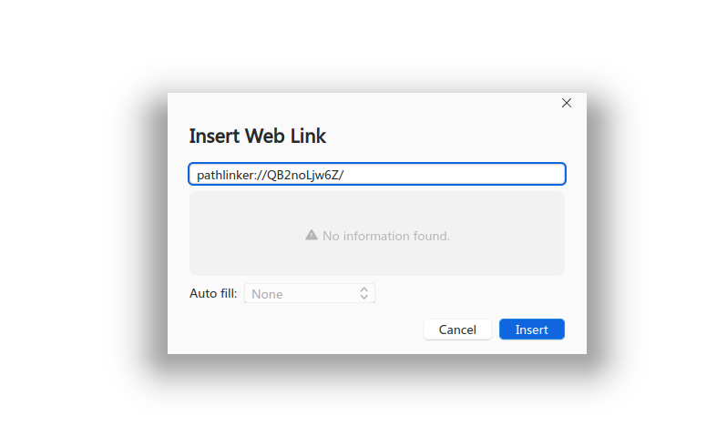
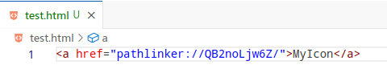
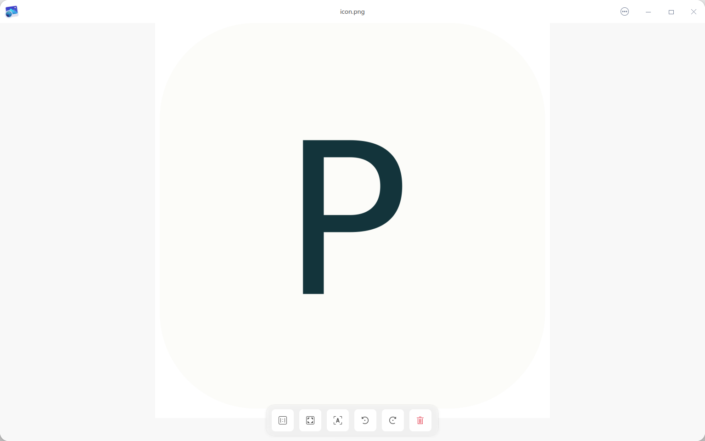

<div align="center">
  
  <h1>PathLinker</h1>
  <p>🔗 在您的计算机上任何地方链接您的任意文件！ 🔗</p>
</div>

[](./README.md)
[](./README_CN.md)

## ✨ 功能
- 支持Windows、Linux
- 可以将您的文件通过程序将路径转为URL，并在可以使用URL的地方使用，比如markdown、HTML、以及一些允许插入URL的其他程序之中
- URL所对应的文件可通过URL进行打开
## 📦 安装
### Windows
1. 下载并解压[pathlinker_0.1.0.1_x64_windows.zip](https://github.com/JeseKi/PathLinker/releases/download/preview/pathlinker_0.1.0.1_x64_windows.zip)
2. 双击`pathlinker_0.1.0.1_x64_windows.msi`进行安装(**推荐不修改安装路径**)
3. 执行`register.bat`来添加注册表项

### Linux
#### deb
1. 下载[deb包](https://github.com/JeseKi/PathLinker/releases/download/preview/pathlinker_linux_0.1.0-1_amd64_AppImage.zip)

2. 执行`sudo dpgk -i pathlinker_linux_0.1.0-1_amd64.deb`
#### AppImage
1. 下载并解压[pathlinker_linux_0.1.0-1_amd64_AppImage.zip](https://github.com/JeseKi/PathLinker/releases/download/preview/pathlinker_linux_0.1.0-1_amd64_AppImage.zip)
2. 执行
```bash
# 将应用添加到注册表
sudo bash init.sh
# 赋予执行权限
sudo chmod +x pathlinker_0.1.0-1_amd64.AppImage
```

### Mac
由于我还没有Mac，因此希望有Mac的开发者能够帮我完成这个部分，如有意向请联系我的邮箱。
## 🛠️ 用法
1. 打开`pathlinker`
2. 点击`select files`

3. 选择您要映射的文件(可以一次性选择多个)

4. 您可以点击`copy`来复制该映射对应的URL

5. 现在您可以在其他地方使用该URL来打开该文件，比如Obsidian(一款Markdown笔记软件):


或者XMind(一款思维导图软件):



当然，也包括HTML:



6. 现在您点击了URL后，将会使用默认软件进行打开文件:


## 📝 ToDo
- [ ] 支持Mac
- [ ] 多语言
- [ ] 自动更新
- [ ] 设置页面
  - [ ] 特别的，允许对已映射的部分/全部文件进行备份与自动更新
  - [ ] 自动跟踪指定路径下所监控文件的路径变化，并自动更新到数据库中
  - [ ] 使用特定的软件来打开指定拓展名的文件
- [ ] 打开文件时报错的实现，而非显示`log.txt`
- [ ] 允许导出/导入文件映射数据

## 😕 FAQ

### 为什么我点击URL后没有打开任何文件？
请检查是否有按照步骤执行，在Windows上要注意运行`register.bat`，在Linux上如果使用的是AppImage，需要运行`init.sh`。若还是无法运行请尝试提交issues。

### 安全吗？
PathLinker的原理是将文件的路径存储到数据库中，并生成一个随机的URL一起存储进数据库中，当点击该URL的时候，系统注册表会将URL传递给应用，应用接受到URL后将自动在数据库中查询对应的路径，根据获取到的路径来调用默认程序打开文件。
因此您可以不用担心下面的问题:
1. URL泄露到网上是否会导致文件被访问？
2. 数据库泄露到网上是否会导致文件被访问？
3. 软件是否会不小心修改系统重要文件？

不过也因此造成了在换了台电脑后可能点击URL无法打开文件，因为数据库中存储的路径是您本机的路径，因此需要重新映射。

我们将在更新对文件的备份与自动更新后解决这个问题。